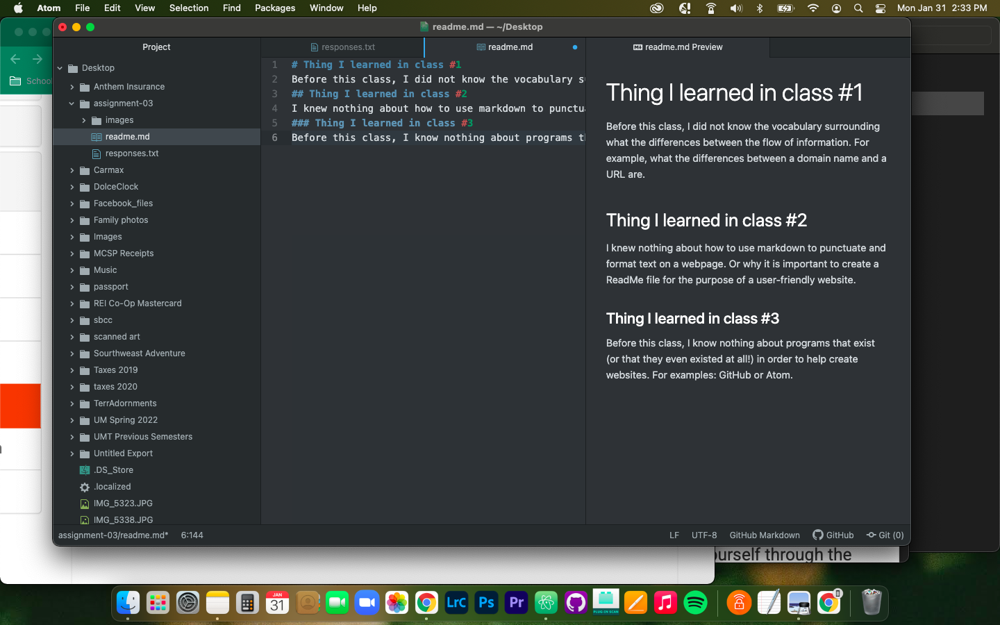

# Thing I learned in class #1
Before this class, I did not know the vocabulary surrounding what the differences between the flow of information. For example, what the differences between a domain name and a URL are.
## Thing I learned in class #2
I knew nothing about how to use markdown to punctuate and format text on a webpage. Or why it is important to create a ReadMe file for the purpose of a user-friendly website.
### Thing I learned in class #3
Before this class, I know nothing about programs that exist (or that they even existed at all!) in order to help create websites. For examples: GitHub or Atom.

[Course Website: URLS](https://ashley-rezvani.github.io/341-web-design-Spring2022/topic-02/urls-relative/)

[My Responses](./responses.txt)

