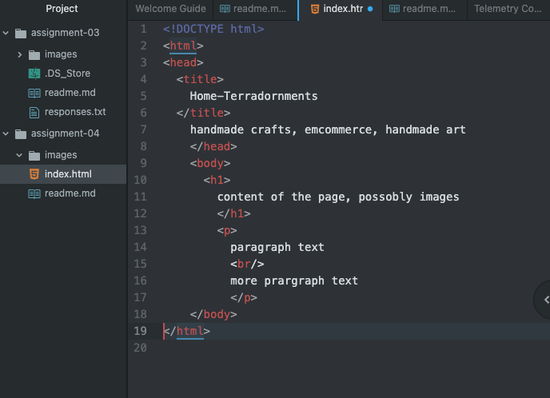

A web browser serves as agency for the user to access any part of the internet.  It retrieves information from other parts of the web and allows you to see it on a person device. This information is coded and created anyone. It is then translated it into a format for easy viewing and interaction. I really only ever use Google Chrome on both my computer and mobile phone, except for the times when I click a link and it automatically opens Safari for some reason.

