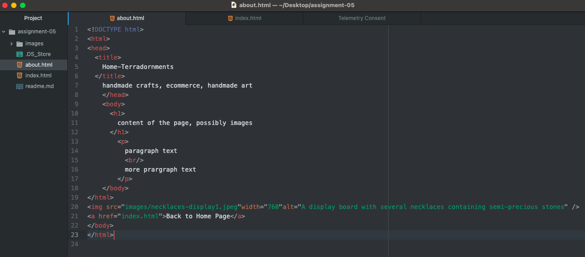

I chose to look at the website Etsy on May 14th, 2006. It looks way different than it does today and even has a different slogan. The font they used for the text was pretty much all the same for every button and the layout is very rudimentary. Today, their website has a sense of aesthetic that compliments its content -- a place where people can shop for and sell their handmade items.
