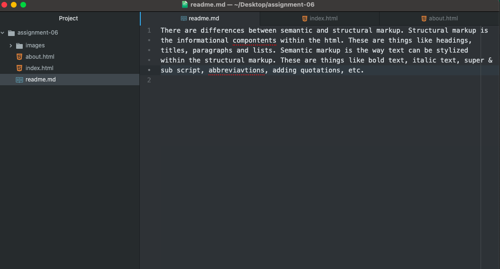

There are differences between semantic and structural markup. Structural markup is the informational compontents within the html. These are things like headings, titles, paragraphs and lists. Semantic markup is the way text can be stylized within the structural markup. These are things like bold text, italic text, super & sub script, abbreviavtions, adding quotations, etc.
