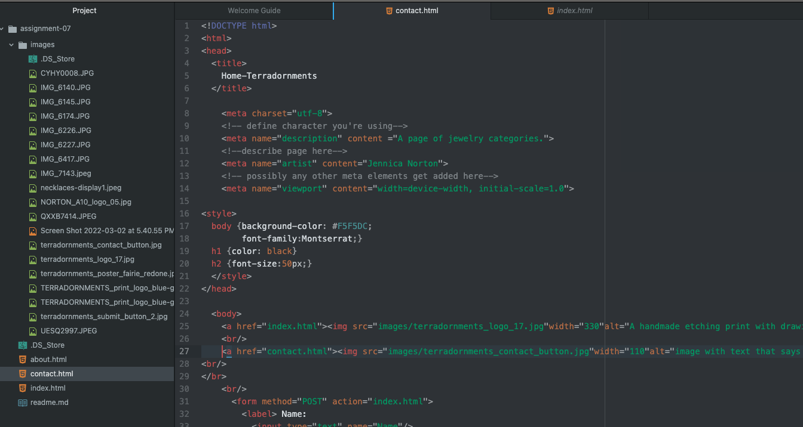

When filling out virtual paperwork for school, a medical reason, or even when
taking silly trivia "quizzes" online, are all times when I've used forms.
They come in varying forms. Some are check-boxes, some are spaces to type in
your own response, some have drop-down menus to choose from a list of pre-
determined responses.
